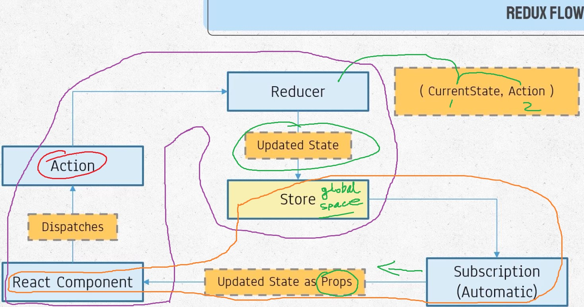

## Redux_react (is a indipendent node package, we can use it with react)

## basic: https://github.com/niamul64/Redux_react/tree/main/basic
## Redux with react app(restaurent project) see: https://github.com/niamul64/Redux_react/tree/main/restaurent%20project%20with%20form