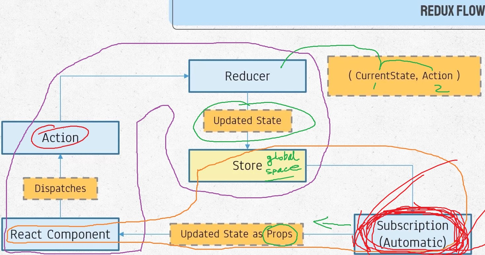

## For learning the basic of redux, using node package to directly run the redux code
## Not using the recat for now.

```
$ npm init --yes // initialize node package
```

# 1. install Redux
```
npm install redux --save
```
# 2. open a js file to write js code
```
///  inside index.js
const redux_obj= require('redux');  // making a redux obj
console.log(redux_obj);
```
# 3. to execuit the file index.js
```
$ node index.js
```


<br><hr>
 
# Now create store (global space)
### 1. CreateStore() accepts a reducer function, Need to create reducer first
```
const rootReducer = (state, action) => {
      //state is current state// what changes will happen, is defined in 'action' 
      // action could be: delete, update, etc
      return state; // it will return the changed state// currently
}

const store = redux_obj.createStore(rootReducer);
console.log(store); // will return all the function that we can use 
console.log(store.getState()); // will print the most updated state

```
<br>

# Dispatching action (send someting)
## Using dispatching we will send action to reducer, to perform something
```
const redux_obj = require('redux');

// console.log(redux_obj);

// state demo
const initState = {
      num: 0
}
//  state demo

/// reducer obj create
const rootReducer = (state = initState, action) => {
      //state is current state// what changes will happen, is defined in 'action' 
      // action could be: delete, update, etc
      if (action.type === 'INC_NUM') {
            return {
                  ...state, // making a copy of the main state
                  num: state.num + 1 // what to perform
            }
      }
      if (action.type === 'ADD_NUM') {
            return {
                  ...state, // making a copy of the main state
                  num: state.num + action.value // what to perform
            }
      }
      return state;
      // it will return the changed state// currently

}/// reducer obj create

const store = redux_obj.createStore(rootReducer);  ////   create store

// Dispatch function, can write multiple function
store.dispatch({// Dispatch function
      type: 'INC_NUM' // 'type' fixed keyword
      // type is a key ward, we need to say operation here
});
console.log(store.getState());// output will { num: 1 }
store.dispatch({// Dispatch function
      type: 'ADD_NUM', // 'type' fixed keyword // value have tobe upper case
      // type is a key ward, we need to say operation here
      value: 34
});
console.log(store.getState()); // output: { num: 35 }
```
<br><br>

# Subscribe: every time an action dicpatches-> subscribe function will call 


```
const redux_obj = require('redux');

// console.log(redux_obj);

// state demo
const initState = {
      num: 0
}
//  state demo

/// reducer obj create
const rootReducer = (state = initState, action) => {
      //state is current state// what changes will happen, is defined in 'action' 
      // action could be: delete, update, etc
      if (action.type === 'INC_NUM') {
            return {
                  ...state, // making a copy of the main state
                  num: state.num + 1 // what to perform
            }
      }
      if (action.type === 'ADD_NUM') {
            return {
                  ...state, // making a copy of the main state
                  num: state.num + action.value // what to perform
            }
      }
      return state;
      // it will return the changed state// currently

}/// reducer obj create

const store = redux_obj.createStore(rootReducer);  ////   create store

store.subscribe(() => { //this function, each time will be called, when a action is performed 
      console.log(store.getState()); // output: { num: 1 } //output: { num: 35 }
})

// Dispatch function, can write multiple function
store.dispatch({// Dispatch function
      type: 'INC_NUM' // 'type' fixed keyword
      // type is a key ward, we need to say operation here
});

store.dispatch({// Dispatch function
      type: 'ADD_NUM', // 'type' fixed keyword // value have tobe upper case
      // type is a key ward, we need to say operation here
      value: 34
});
```